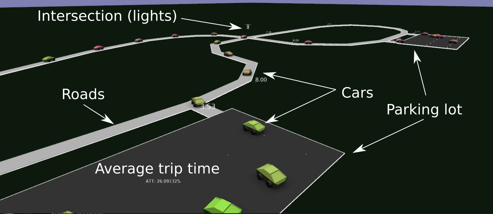

# DSim - a simple traffic simulator

DSIM was a quick christmas project to create a very simple traffic simulator.
Mostly, I was just interested in visualizing the effect a slow-down has on future
traffic, etc.

## Simulator Overview

The simulator has a simple level representation and cars that randomly drive in the
map.

A simple rendering is given below:



Best understood by looking at the following video: https://www.youtube.com/watch?v=Wc3W8RjP2IQ,
which shows how the cars in the simulator interact
with the road/intersections, as well as various levels and a few rendering modes.

[](https://www.youtube.com/watch?v=Wc3W8RjP2IQ)


Here's a simple heatmap rendering of a level that looks like a figure eight with
a set of traffic lights in the center:


### Level representation

The [level](src/level/level.h) consists of roadways, parking lots, and traffic controls (e.g., 
stop signs or lights). Cars originate in one of the parking lots, and drive to a random 
location. Each of the elements are listed below, but you can get a sense of the state by 
looking at the proto representation in [src/level.proto](src/level.proto).

#### Roads

* Road's are one-way and consist of a bunch of [Road Segments](src/level/road_segment.h). 
Each Road Segment
is an ordered array of 2D points and has a speed limit that the Cars will try to obey.

#### Parking lots

* A [Parking Lot](src/level/parking_lot.h) is simply a rectangular region with a bunch of parking spots (points)
within it. Cars will start at a random parking spot and choose to drive to another
random parking spot in a parking lot.

#### Traffic controls

There 2 types of traffic controls:

1. Stop signs: stop signs are annotated with a direction and are only enforced in that direction
1. Traffic lights: affect all incoming road segments. There is a timer on the light. The timer
will advance through each incoming road segment so that it is only green for "timer" 
seconds for each incoming segment sequentially.

### Navigation / Car Control

The car control is pretty simple. Each time the car reaches a destination, it charts
a new path to a new destination (using A*; code in [src/plan/plan.cc](src/plan/plan.cc)). 
The simulator estimates the speed along the road segments, so if a segment is moving
 slowly, the car should choose another path. Once the path is found, the car simply 
follows the path (it doesn't  replan) until it reaches its destination.

#### Collision avoidance

Cars try to accelerate until they reach either their max speed or the max speed of 
the roadway. The car will decelerate in one of the following conditions:

* If a hard corner is coming up. Cars have a maximum speed they can go through a
right-angle corner. They will start to decelerate to allow enough time to slow down.
* If there is an upcoming intersection that is not green
* If there are some cars ahead

There is no real collision detection: each car simply tries to decelerate to meet 
the above conditions. Sometimes it doesn't work out and cars will overlap.

#### Path following

To achieve some sort of realism in the paths that are not straight lines, and to avoid 
having to use a finely tesselated curve for the roads, all roads are interpretted
as being smooth (if they are long enough). This is done using an implied
 quadratic bezier curve.

The path following interpolation adjusts the road segment points to apply the bezier 
curve. Distance of the smoothed curve is approximated using a simple integral.


## Level editing

The levels can currently be edited in blender. See the examples in the [levels](levels) directory


Parking lots are simple 2D rectangular planes (centered on the origin). "Empty"s parented 
to the planes will be interpreted as parking spots.

Roads are "path" objects in blender. They can be annotated with a custom "speed" entry
to control the speed limit.

Traffic controls are also "empty" objects without a parent. The name of the empty, if
prefixed with either "Stop" or "Lights" will be interpretted as the respective traffic control. 
Stop signs are aligned with the y-axis of the empty. Traffic lights have a custom 
property "timer" that dictates the frequency of the update.

A rendering of the above level (in the simulator) looks like the following:


where the annotations on the ground indicate the approximate speed of the segments.

The [python/export_level.py](python/export_level.py) script can be used to export the 
[proto representation](src/level.proto) of the level.


# Building & Running

## Dependencies

 * Bazel
 * GLog
 * Proto
 * https://github.com/nbirkbeck/nimage
 * And a few of my other internal libraries: nmisc (for updateable heap), nmath 
(for 2d vector math), and nappear for mesh/rendering.

## Run


From the src directory you can run a level (in the [levels](levels)) directory with the 
default opengl visualization using:

```
bazel run -c opt :main -- 
   --filename $(pwd)/../levels/big_level.textpb \
   --model_dir $(pwd)/../models --logtostder
```

Press 'f' to enter a first  person view mode.

Roads are annotated with the average speed of cars travelling on them (or their 
default max speed limit). And there is a "ATT:" (average trip time) tracker in the bottom
left of the screen.

### Other arguments:


The ```--benchmark=``` argument can be one of ```sim```, ```render```, or ```plan```. And can be used to benchmark
the simulation, the rendering, or planning. On my machine the 1k_cars.textpb can
run about 50x realtime (suggesting a limit of 50K cars).


The ```--heatmap``` argument can be used to render heatmap visualizations (results stored in 
/tmp/im-*png)

## Scripts

Run timed benchmarks of the simulator on large levels:

```
sh scripts/benchmark_sim.sh
```

Generate videos and gifs:

```
sh scripts/generate_videos.sh
```
